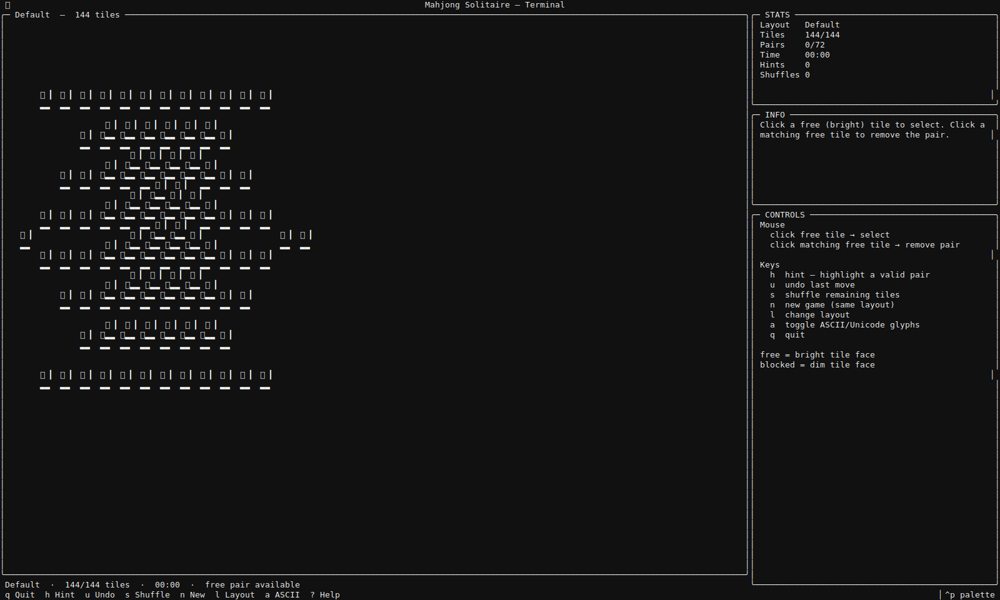
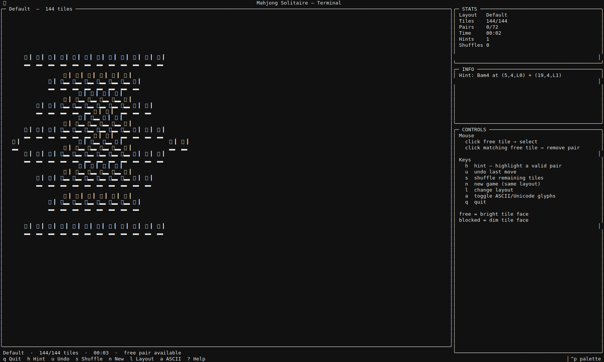
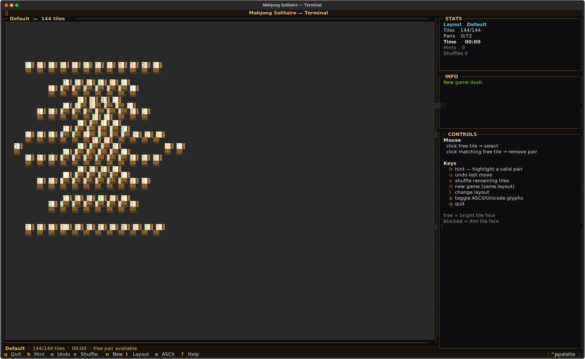

# mahjong-tui
One tile closer to enlightenment.





## About
Seventy-two KMahjongg layouts, rendered in 2D ASCII with depth shading that tells you what's on top. Match free pairs. Clear the stack. Unicode or pure-ASCII display, live hints, unlimited undo. The ancient tile game made terminal — calm, methodical, impossible to quit just one round of.

## Screenshots


## Install & Run
```bash
git clone https://github.com/akakabrian/mahjong-tui
cd mahjong-tui
make
make run
```

## Controls
<Add controls info from code or existing README>

## Testing
```bash
make test       # QA harness
make playtest   # scripted critical-path run
make perf       # performance baseline
```

## License
GPL-3.0

## Built with
- [Textual](https://textual.textualize.io/) — the TUI framework
- [tui-game-build](https://github.com/akakabrian/tui-foundry) — shared build process
